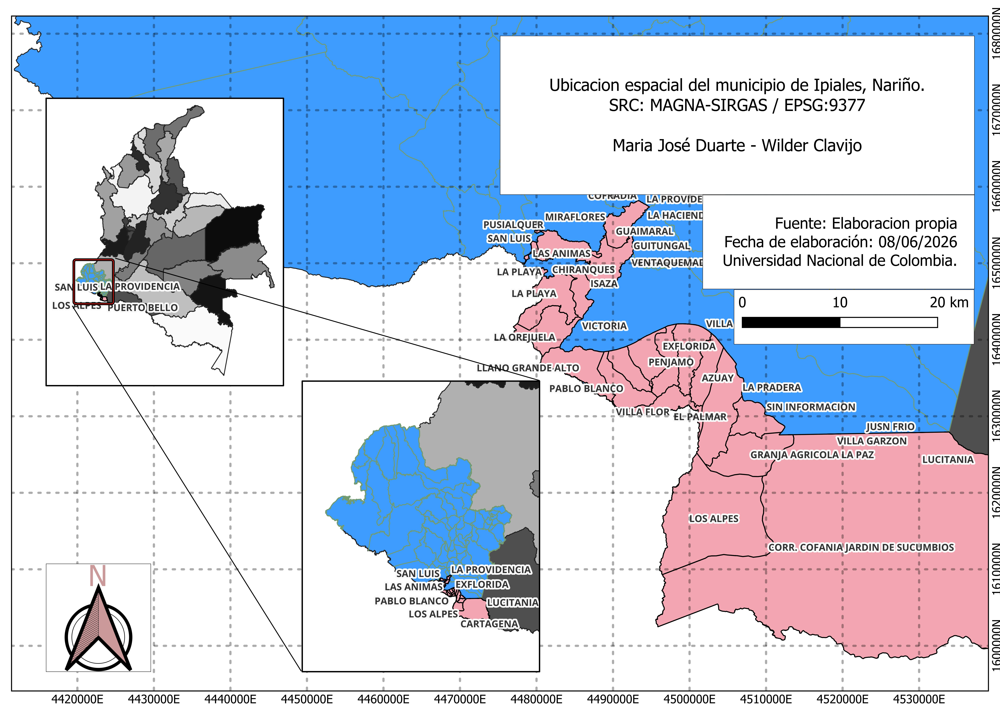
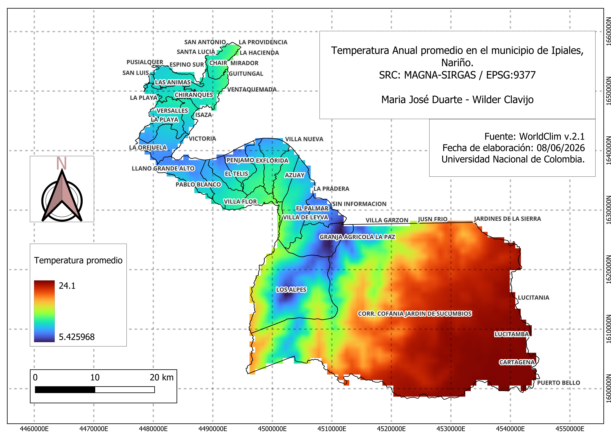
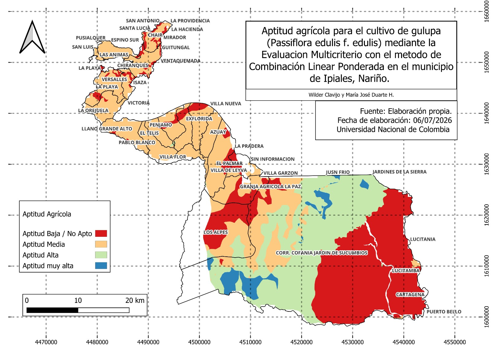

# Introducción

El cultivo de gulupa (*Passiflora edulis* Sims) representa una oportunidad comercial a nivel nacional e internacional, consolidándose como producto de alto potencial de exportación en los últimos años (Escobar Quiñónez et al., 2024). Actualmente, es el quinto fruto más exportado en el país, siendo Colombia el principal proveedor de este producto hacia la Unión Europea (Cáceres, 2026). La mayoría de las zonas productoras se han establecido en las últimas dos décadas en diferentes departamentos, entre los que destacan Antioquia, Cundinamarca, Boyacá y Huila, reconocidos por su producción de frutas con calidad de exportación gracias a sus condiciones agroecológicas favorables (De Armas Costa et al., 2022).

En este contexto, debido a la creciente demanda de este fruto en el mercado internacional, la industria agrícola ha identificado la necesidad de expandir el área cultivada de gulupa en el país (Cuspoca-Chaparro et al., 2023). Entre los departamentos con potencial para incrementar la producción se encuentra Nariño, donde se han registrado plantaciones con fines de exportación (ICA, 2019) y podrían destinarse nuevas áreas para el cultivo en diferentes municipios, como es el caso de Ipiales que presenta condiciones de temperatura, altitud y paisaje que, en general, son favorables para el desarrollo del cultivo (Ocampo y Wyckhuys, 2012).

Sin embargo, al ser un cultivo semipermanente que implica una alta inversión inicial (Ocampo y Wyckhuys, 2012), determinar zonas adecuadas para las plantaciones de gulupa representa un reto importante. Por esto, es necesario realizar análisis integrales para el establecimiento del cultivo que consideren variables espaciales, climáticas, edáficas, topográficas y sociales, con el fin de apoyar la toma de decisiones informadas. Así mismo, para el caso de Ipiales, existen nicho térmicos muy variables que incluyen el corregimiento Jardín de Sucumbíos que desciende hasta los 1200 msnm, así como cañones y vertientes en los que las temperaturas son diversas, lo que resalta la importancia de evaluar de forma integral las zonas de estudio previo al establecimiento. 

Para esto, el uso de las herramientas de geomática, como los Sistemas de Información Geográfica (SIG),resulta esencial para la planificación territorial de sistemas productivos agrícolas, ya que permite integrar, procesar y analizar múltiples variables espaciales facilitando la evaluación de la aptitud del territorio a diferentes escalas espaciales y temporales (Saraiva et al., 2025; Ceballos-Silva y López-Blanco 2010). Por su parte, la Evaluación Multicriterio (EMC) es una metodología de análisis espacial que permite integrar múltiples variables biofísicas y socioeconómicas en un único índice de aptitud territorial. 

Diversos estudios han demostrado la utilidad de este enfoque para identificar áreas con potencial productivo a partir de la integración de variables climáticas, edáficas, topográficas, hidrológicas y de infraestructura. Investigaciones realizadas en Pakistán identificaron zonas aptas para la agricultura bajo altas presiones urbanas (Hussain et al., 2024), en México se han delimitado áreas para cultivos alternativos como el nopal optimizando suelos degradados (Ceballos-Silva y López-Blanco, 2010), en Egipto se utilizaron modelos híbridos para evaluar la aptitud para microirrigación de acuerdo a la calidad del agua y generar mapas de aptitud para trigo y maíz en áreas áridas (Abuzaid & El-Husseiny, 2022) y en Turquia, estas herramientas se han utilizado para encontrar alternativas para el crecimiento agrícola debido a planificaciones estatales (Akıncı et al., 2013). 

De esta manera, se puede generar información precisa que respalde la toma de decisiones, reduciendo la incertidumbre del productor, aumentando la probabilidad de desarrollar proyectos productivos rentables y promoviendo sistemas sostenibles que hagan un uso eficiente de los recursos naturales.

En este sentido, la evaluación de aptitud territorial para el cultivo de gulupa, basada en la integración de múltiples variables ambientales y socioeconómicas junto con los requerimientos agroecológicos de la especie, constituye una herramienta fundamental para orientar la expansión sostenible del cultivo en municipios con potencial productivo como Ipiales, justificando un modelo espacial preventivo para reducir los riesgos a los que se enfrenta el agricultor.

# Objetivos

Evaluar la aptitud territorial para el establecimiento de un sistema productivo de gulupa en el municipio de Ipiales, mediante el uso de Sistemas de Información Geográfica (SIG) y técnicas de análisis multicriterio. 

* Analizar y procesar variables biofísicas y de accesibilidad mediante herramientas SIG, con el fin de generar mapas temáticos que caracterizan las condiciones del área de estudio.

* Integrar las variables seleccionadas a través de un modelo de análisis multicriterio espacial, aplicando procesos de normalización y ponderación, para delimitar zonas con diferentes niveles de aptitud para el cultivo de gulupa.

# Área de Estudio 

El municipio de Ipiales se localiza en el sur del departamento de Nariño, en la frontera colombo-ecuatoriana (latitud ~0°50'N, longitud ~77°39'W). Se caracteriza por un relieve andino con altitudes entre 2.800 y 3.400 msnm, aunque existen vertientes y cañones que descienden hasta 1.200 msnm, condición que genera una importante variabilidad bioclimática y hace del municipio un territorio con zonas potencialmente aptas para la gulupa.



# Fuentes de Datos

Para la elaboración del análisis, se recopiló información geoespacial de las variables que influyen en la aptitud para el cultivo de gulupa en el área de estudio (Tabla 1). 

Se utilizaron plataformas institucionales, catálogos geográficos y herramientas de datos espaciales para obtener las variables necesarias del análisis. Para la caracterización de los criterios físicos, como las variables climáticas, se utilizaron bases de datos climáticos de acceso abierto como WorldClim y nacionales como el Instituto de Hidrología, Meteorología y Estudios Ambientales (IDEAM), así como plataformas de
análisis geoespacial como Google Earth Engine.Adicionalmente, se integraron registros provenientes de estaciones meteorológicas cercanas al área de estudio para mayor precisión y representatividad.

Para la oferta edafológica se obtuvo la información de los catálogos y bases de datos del Instituto Geográfico Agustín Codazzi (IGAC). Para el análisis de accesibilidad, se tomaron capas de información vial e infraestructura de plataformas de acceso abierto como OpenStreetMap con el fin de evaluar la conectividad del territorio y su relación con las áreas
potenciales.

**Tabla 1.** Fuentes y características de las variables utilizadas para el análisis. 

::: {.table-responsive}

| Variable | Capa / Fuente | Resolución original |
|---|---|---|
| Temperatura promedio | WorldClim v2.1 (BIO1) / GEE | ~1 km |
| Altitud | DEM SRTM 1-arc-second / GEE | 30 m |
| Precipitación anual | WorldClim v2.1 (BIO12) / GEE | ~1 km |
| Riesgo de heladas | IDEAM – Atlas Climatológico / WorldClim BIO6 | ~1 km |
| Uso actual del suelo | IGAC – Cobertura CORINE Land Cover Colombia | 30 m |
| Humedad Relativa | WorldClim (BIO15 proxy) / IDEAM | ~1 km |
| Profundidad del suelo | IGAC – Estudio General de Suelos de Nariño | Vectorial |
| Textura de suelos | IGAC – Estudio General de Suelos de Nariño | Vectorial |
| Fertilidad natural | IGAC – Estudio General de Suelos de Nariño | Vectorial |
| Horas sol | IDEAM – Atlas de Radiación Solar | Vectorial / Raster |
| Acidez (pH) | SoilGrids (ISRIC) / IGAC | 250 m |
| Geomorfología | IGAC – Mapa Geomorfológico de Colombia | Vectorial |
| Vientos | WorldClim / IDEAM | ~1 km |
| Evapotranspiración | WorldClim / FAO – ETo | ~1 km |
| Paisaje | IGAC – Unidades de Paisaje | Vectorial |

:::

# Metodología 

## Requerimientos de software

**Tabla 2.** Requerimientos de software para el proyecto.

::: {.table-responsive}
| Software / Herramienta | Versión recomendada | Uso en el análisis |
|---|---|---|
| QGIS | ≥ 3.28 LTR | Plataforma principal de geoprocesamiento |
| SAGA GIS (integrado en QGIS) | Automático | Reclasificación raster avanzada |
| GRASS GIS (integrado en QGIS) | Automático | Análisis de pendientes, distancias |
| Calculadora Raster QGIS | Nativa | Combinación lineal ponderada (WLC) |
| Python + GDAL (opcional) | ≥ 3.10 | Automatización de reclasificación |
| Google Earth Engine | Cuenta registrada | Descarga de capas climáticas (WorldClim, SRTM) |
:::

## Preparación y Homogenización de capas

Se reproyectaron todas las capas descritas en la Tabla 1 al sistema de coordenadas MAGNA-SIRGAS / Colombia Zona Centro-Oeste EPSG:9377 y se utilizó el límite municipal de Ipiales como máscara de recorte para todas las capas. Además, de estableció el tamaño de celda uniforme de 30 m para todo el análisis con el fin de asegurar que las capas presenten la misma extensión, resolución y SRC. Esto se comprobó con el alineamiento de rásteres en QGIS.

```python
# Remuestreo y reproyección con GDAL (Python) — todas las capas al mismo grid
from osgeo import gdal
import os

capas_entrada = [
    "temperatura_promedio.tif",
    "altitud_srtm.tif",
    "precipitacion_anual.tif",
    "humedad_relativa.tif",
    "horas_sol.tif",
    "uso_actual.tif",
    "profundidad_suelo.tif",
    "textura_suelo.tif",
    "fertilidad_natural.tif",
    "vientos.tif",
    "evapotranspiracion.tif",
    "riesgo_heladas.tif",
    "geomorfologia.tif",
    "paisaje.tif",
    "acidez_ph.tif"
]

raster_referencia = "altitud_srtm_9377.tif"  # Define la grilla de referencia
directorio_salida = "capas_homogenizadas/"
os.makedirs(directorio_salida, exist_ok=True)

ds_ref = gdal.Open(raster_referencia)
gt = ds_ref.GetGeoTransform()
proj = ds_ref.GetProjection()
cols = ds_ref.RasterXSize
rows = ds_ref.RasterYSize

for capa in capas_entrada:
    nombre_salida = os.path.join(directorio_salida, os.path.basename(capa).replace(".tif", "_9377_30m.tif"))
    gdal.Warp(
        nombre_salida,
        capa,
        dstSRS="EPSG:9377",
        xRes=30, yRes=30,
        resampleAlg="bilinear",
        outputBounds=(gt[0], gt[3] + rows * gt[5], gt[0] + cols * gt[1], gt[3])
    )
    print(f"Procesado: {nombre_salida}")

ds_ref = None
print("Homogenización completada.")
```

## Reclasificación por Criterio

El método implementado corresponde a la Combinación Lineal Ponderada (WLC — *Weighted Linear Combination*), en la que cada capa reclasificada se multiplica por su peso AHP y los productos se suman en la Calculadora Raster de QGIS. Los pesos fueron definidos mediante el Proceso Analítico Jerárquico (AHP) de Saaty (1980), priorizando los factores climáticos como limitantes principales para la gulupa en el altiplano nariñense. 

Esta metodología funciona dado el número de variables involucradas, el control, trazabilidad y transparencia del procedimiento al realizarlo en la Calculadora Raster. 

La escala de aptitud utilizada es de 1 a 4 en donde: 

- **4** = Muy Apto (óptimo para la gulupa)
- **3** = Moderadamente Apto
- **2** = Marginalmente Apto
- **1** = No Apto

Cada raster de las capas descritas se reclasificó en esta escala previo a la combinación ponderada y siguiendo los criterios de reclasificación presentados en la Tabla 3 de acuerdo a la revisión bibliográfica realizada. 

**Tabla 3.** Clasificación del grado de aptitud para cada variable. 

::: {.table-responsive}

| Variable | Aptitud Alta (4) | Aptitud Media (3) | Aptitud Baja (2/1) | Fuente |
|-----------|------------------|-------------------|-------------------|----------------------|
| Temperatura Promedio (°C) | 15 – 18 o 15 – 20 | 12 – 15 / 20 – 24 | < 10 o > 25 (Aborto floral) | (Ocampo & Wyckhuys, 2012; Pérez & Melgarejo, 2012) |
| Altitud (msnm) | 1.700 – 2.200 | 1.400 – 1.700 / 2.200 – 2.500 | < 900  / > 2.600 | (Ocampo & Wyckhuys, 2012; Guerrero-López et al., 2012) |
| Precipitación Anual (mm) | 1.300 – 1.800 | 900 – 1.300 / 1.800 – 2.500 | < 900 o > 2.500 | (Ocampo & Wyckhuys, 2012; Angulo, 2009) |
| Humedad Relativa (%) | 60 – 70 o 80 – 94* | 70 – 80 | > 95 | (Angulo, 2009; Pérez & Melgarejo, 2012) |
| Radiación Solar (h/día) | 9 – 13 | 7 – 9 | < 7 | (Ocampo & Wyckhuys, 2012; Pérez & Melgarejo, 2012) |
| Acidez del Suelo (pH) | 6,0 – 7,0 (Óptimo 6,5) | 5,5 – 6,0 / 7,0 – 7,5 | < 5,5 o > 7,5 | (Ocampo & Wyckhuys, 2012; De-Armas-Acosta et al., 2022) |
| Profundidad Efectiva (cm) | ≥ 60 | 50 – 60 | < 30  | (Ocampo & Wyckhuys, 2012; Angulo, 2009) |
| Textura del Suelo | Franca, Fr-Arenosa, Fr-Arcillosa | Franco-limosa | Arcillosa | (Ocampo & Wyckhuys, 2012; Angulo, 2009) |
| Fertilidad (Mat. Orgánica) | ≥ 5% | 3% – 5% | < 3% | (Ocampo & Wyckhuys, 2012) |
| Vientos (km/h) | Bajos (≤ 50) | Moderados | Fuertes y constantes | (Ocampo & Wyckhuys, 2012; Guerrero-López et al., 2012) |
| Pendiente (%) | 15% – 30% | < 15% / 30% – 100% | > 100% (45°) o inundables | (Ocampo & Wyckhuys, 2012; Angulo, 2009) |
::: 
 
## Reclasificación en QGIS

Se automatizó la reclasificación de los rasters númericos conitinuos garantizando reproducibilidad 

```python
#| label: reclasificacion_python
#| eval: false

import numpy as np
import rasterio
from rasterio.transform import from_origin
import os

def reclasificar_raster(ruta_entrada, ruta_salida, rangos_valores):
    """
    Reclasifica un raster continuo según una tabla de rangos.
    
    Parámetros:
    -----------
    ruta_entrada : str
        Ruta al raster continuo de entrada (.tif)
    ruta_salida : str
        Ruta donde se guardará el raster reclasificado (.tif)
    rangos_valores : list of tuples
        Lista de (valor_minimo, valor_maximo, clase_asignada)
        Ej: [(1700, 2200, 4), (2200, 2500, 3), ...]
    """
    with rasterio.open(ruta_entrada) as src:
        datos = src.read(1).astype(float)
        perfil = src.profile
        nodata = src.nodata if src.nodata is not None else -9999
    
    # Inicializar con valor No Apto (1) por defecto
    datos_rc = np.ones_like(datos, dtype=np.int16)
    
    # Aplicar máscara de nodata
    mascara_nodata = (datos == nodata) | np.isnan(datos)
    
    # Aplicar rangos en orden (el último rango que aplique tiene prioridad)
    for vmin, vmax, clase in rangos_valores:
        condicion = (datos >= vmin) & (datos < vmax)
        datos_rc[condicion] = clase
    
    # Restaurar nodata
    datos_rc[mascara_nodata] = -9999
    
    # Guardar raster reclasificado
    perfil.update(dtype="int16", nodata=-9999, count=1)
    with rasterio.open(ruta_salida, "w", **perfil) as dst:
        dst.write(datos_rc, 1)
    
    print(f"Reclasificado: {os.path.basename(ruta_salida)}")
    unique, counts = np.unique(datos_rc[~mascara_nodata], return_counts=True)
    for u, c in zip(unique, counts):
        print(f"  Clase {u}: {c} píxeles ({c / datos_rc[~mascara_nodata].size * 100:.1f}%)")


# -------------------------------------------------------
# TABLAS DE RECLASIFICACIÓN (según criterios establecidos)
# -------------------------------------------------------

# Directorio de capas homogenizadas
dir_entrada = "capas_homogenizadas/"
dir_salida  = "capas_reclasificadas/"
os.makedirs(dir_salida, exist_ok=True)

# 1. ALTITUD (msnm)
reclasificar_raster(
    ruta_entrada = dir_entrada + "altitud_srtm_9377_30m.tif",
    ruta_salida  = dir_salida  + "RC_Altitud.tif",
    rangos_valores = [
        (0,    1400, 1),
        (1400, 1700, 2),
        (1700, 2200, 4),
        (2200, 2500, 3),
        (2500, 3000, 2),
        (3000, 9999, 1)
    ]
)

# 2. TEMPERATURA PROMEDIO ANUAL (°C)
reclasificar_raster(
    ruta_entrada = dir_entrada + "temperatura_promedio_9377_30m.tif",
    ruta_salida  = dir_salida  + "RC_Temperatura.tif",
    rangos_valores = [
        (0,  10, 1),
        (10, 15, 3),
        (15, 20, 4),   # Óptimo
        (20, 24, 3),
        (24, 30, 2),
        (30, 99, 1)
    ]
)

# 3. PRECIPITACIÓN ANUAL (mm)
reclasificar_raster(
    ruta_entrada = dir_entrada + "precipitacion_anual_9377_30m.tif",
    ruta_salida  = dir_salida  + "RC_Precipitacion.tif",
    rangos_valores = [
        (0,    800,  1),
        (800,  1000, 2),
        (1000, 1300, 3),
        (1300, 1800, 4),   # Óptimo
        (1800, 2200, 3),
        (2200, 2500, 2),
        (2500, 9999, 1)
    ]
)

# 4. HUMEDAD RELATIVA (%)
reclasificar_raster(
    ruta_entrada = dir_entrada + "humedad_relativa_9377_30m.tif",
    ruta_salida  = dir_salida  + "RC_HumedadRelativa.tif",
    rangos_valores = [
        (0,  50, 1),
        (50, 60, 3),
        (60, 70, 4),   # Óptimo
        (70, 80, 3),
        (80, 100, 2)
    ]
)

# 5. HORAS DE SOL (h/día)
reclasificar_raster(
    ruta_entrada = dir_entrada + "horas_sol_9377_30m.tif",
    ruta_salida  = dir_salida  + "RC_HorasSol.tif",
    rangos_valores = [
        (0, 5, 1),
        (5, 7, 2),
        (7, 9, 3),
        (9, 13, 4),    # Óptimo
        (13, 24, 3)
    ]
)

# 6. EVAPOTRANSPIRACIÓN (mm/día)
reclasificar_raster(
    ruta_entrada = dir_entrada + "evapotranspiracion_9377_30m.tif",
    ruta_salida  = dir_salida  + "RC_Evapotranspiracion.tif",
    rangos_valores = [
        (0, 3, 4),     # Baja = óptimo
        (3, 5, 3),
        (5, 7, 2),
        (7, 99, 1)
    ]
)

# 7. PROFUNDIDAD EFECTIVA DEL SUELO (cm)
reclasificar_raster(
    ruta_entrada = dir_entrada + "profundidad_suelo_9377_30m.tif",
    ruta_salida  = dir_salida  + "RC_Profundidad.tif",
    rangos_valores = [
        (0,  20, 1),
        (20, 40, 2),
        (40, 60, 3),
        (60, 999, 4)   # > 60 cm = óptimo
    ]
)

# 8. VIENTOS (km/h)
reclasificar_raster(
    ruta_entrada = dir_entrada + "vientos_9377_30m.tif",
    ruta_salida  = dir_salida  + "RC_Vientos.tif",
    rangos_valores = [
        (0,  10, 4),   # Suaves = óptimo
        (10, 20, 3),
        (20, 40, 2),
        (40, 50, 2),
        (50, 999, 1)
    ]
)

# 9. ACIDEZ (pH)
reclasificar_raster(
    ruta_entrada = dir_entrada + "acidez_ph_9377_30m.tif",
    ruta_salida  = dir_salida  + "RC_pH.tif",
    rangos_valores = [
        (0,   5.0, 1),
        (5.0, 5.5, 2),
        (5.5, 6.0, 3),
        (6.0, 7.0, 4),   # Óptimo
        (7.0, 7.5, 3),
        (7.5, 14,  1)
    ]
)

print("\nReclasificación de rasters continuos completada.")
```

Para la reclasificación de las capas vectoriales que contenían categorías como las capas de Textura, Fertilidad, Uso Actual, Geomorfología y Paisaje derivadas del IGAC se editó la tabla de atributos añadiendo el valor de la reclasificación por aptitud, a continuación se rasterizaron en QGIS bajo los parámetros de resolución descritos anteriormente. 

## Importancia de las Variables

Los pesos fueron derivados mediante el Proceso Analítico Jerárquico (AHP) propuesto por Saaty (1980, 2008), priorizando el clima como factor limitante principal para la gulupa, especialmente temperatura y riesgo de heladas, seguido de los factores edáficos y finalmente los topográficos. La jerarquización de estas variables en modelos espaciales de aptitud ha sido validada en estudios de zonificación agrícola que integran herramientas SIG y AHP (Akinci et al., 2013; Ceballos-Silva & López-Blanco, 2010; Mishra et al., 2015).

Para la agrupación de las variables (Tabla 4), se tuvo en cuenta que la gulupa es fisiológicamente sensible al clima y puede tolerar con manejo agronómico la amyor parte de las limitantes del suelo (encalado, fertilización, drenajes), por eso el clima concentra más de dos tercios del peso total, el suelo un sexto, y la topografía, que actúa más como modulador secundario, el residuo menor, y el uso actual del suelo se dejó como grupo independiente porque no es una condición biofísica sino una restricción de normativa o logística, por lo que su peso se calibró de forma intermedia.

Dentro de cada grupo, cada variable se compara con todas las demás variables del estudio en una única matriz de 15×15. En este análisis se aplicó una comparación pareada única y directa entre las 15 variables y la pertenencia a un grupo se usó únicamente como criterio de coherencia para decidir, en cada comparación, cuál variable domina a cuál y por cuánto.

**Tabla 4.** Peso acumulado de las agrupaciones de las variables. 

::: {.table-responsive}
| Grupo | Variables incluidas | N.º | Peso acumulado |
|---|---|:---:|:---:|
| **Climático** | Temp. promedio, Altitud, Heladas, Precipitación, Humedad relativa, Horas sol, Evapotranspiración | 7 | **68.18 %** |
| **Edáfico (suelos)** | Profundidad, Textura, Fertilidad natural, Acidez (pH) | 4 | **17.95 %** |
| **Uso actual del suelo** | Uso actual | 1 | **8.34 %** |
| **Topográfico** | Geomorfología, Vientos, Paisaje | 3 | **5.46 %** |
:::

### Escala fundamental de Saaty

Toda comparación pareada usa la **escala 1–9** propuesta por Saaty (1980):

**Tabla 5.** Comparación pareada de Saaty.

::: {.table-responsive}
| Valor | Interpretación verbal | Significado en este análisis |
|:---:|---|---|
| **1** | Igual importancia | Las dos variables limitan el cultivo de forma equivalente |
| **2** | Importancia intermedia entre 1 y 3 | Ligera preferencia |
| **3** | Importancia moderada | Una variable es algo más determinante que la otra |
| **4** | Intermedia entre 3 y 5 | — |
| **5** | Importancia fuerte | Una variable es claramente más determinante |
| **7** | Importancia muy fuerte / demostrada | La diferencia es evidente y sustentada en literatura agronómica |
| **9** | Importancia extrema | Una variable domina casi absolutamente a la otra |
:::

Los valores pares (2, 4, 6, 8) son juicios intermedios, cuando la variable de la fila es menos importante que la de la columna, se usa el recíproco (ej. si "Uso actual" (fila) es moderadamente menos importante que "T. Prom" (columna), la celda vale 1/3 = 0.333…). Esta es la razón por la que la matriz es recíproca: la celda $(j,i)$ siempre es $1/\text{celda}(i,j)$, y la diagonal siempre vale 1 (una variable comparada consigo misma es igual de importante que ella misma).

### Construcción de la matriz de comparación pareada

Con la jerarquía y la escala definidas, se compara cada par de variables; el resultado es la matriz recíproca 15×15 que aparece en la hoja de cálculo (los valores fila > 1 indican que la variable de la fila domina a la de la columna; los valores < 1 son los recíprocos):

**Tabla 6.** Matriz de comparación pareada con las variables determinadas para el proyecto.

::: {.table-responsive}
| | T.Prom | Alt | Hel | Uso act. | Pcp. | Hum.R | Prof. | Text. | Fert. | H.sol | Acid. | Geo. | Vi. | Pai. | Eto |
|---|:---:|:---:|:---:|:---:|:---:|:---:|:---:|:---:|:---:|:---:|:---:|:---:|:---:|:---:|:---:|
|**T. Prom**|1|1|2|3|3|3|4|4|5|5|5|7|7|9|9|
|**Alt**|1|1|2|3|3|3|4|4|5|5|5|7|7|9|9|
|**Hel**|0.5|0.5|1|2|2|2|3|3|4|4|4|5|5|7|7|
|**Uso act**|0.333|0.333|0.5|1|1|1|2|2|3|3|3|4|5|6|6|
|**Pcp**|0.333|0.333|0.5|1|1|1|2|2|2|3|3|4|4|5|5|
|**Hum.R**|0.333|0.333|0.5|1|1|1|2|2|2|3|3|4|4|5|5|
|**Prof.**|0.25|0.25|0.333|0.5|0.5|0.5|1|1|2|2|2|3|3|4|4|
|**Text.**|0.25|0.25|0.333|0.5|0.5|0.5|1|1|2|2|2|3|3|4|4|
|**Fert.**|0.2|0.2|0.25|0.333|0.5|0.5|0.5|0.5|1|1|1|2|2|3|3|
|**H. sol**|0.2|0.2|0.25|0.333|0.333|0.333|0.5|0.5|1|1|1|2|2|3|3|
|**Acid.**|0.2|0.2|0.25|0.333|0.333|0.333|0.5|0.5|1|1|1|2|2|3|3|
|**Geo.**|0.143|0.143|0.2|0.25|0.25|0.25|0.333|0.333|0.333|0.5|0.5|1|1|2|2|
|**Vi.**|0.143|0.143|0.2|0.2|0.25|0.25|0.333|0.333|0.333|0.5|0.5|1|1|2|2|
|**Pai.**|0.111|0.111|0.143|0.167|0.2|0.2|0.25|0.25|0.25|0.333|0.333|0.5|0.5|1|1|
|**Eto**|0.111|0.111|0.143|0.167|0.2|0.2|0.25|0.25|0.25|0.333|0.333|0.5|0.5|1|1|
:::

**Cómo leer una fila:** la fila "T. Prom" tiene un 9 en la columna "Paisaje". Esto se lee: *"la temperatura promedio tiene una importancia extrema frente al paisaje"* para determinar la aptitud del territorio. Por reciprocidad, la fila "Paisaje" tiene 1/9 = 0.111 en la columna "T. Prom": el paisaje es extremadamente menos determinante que la temperatura.

**Lógica de asignación de valores:**

1. Se ordenan mentalmente las variables de mayor a menor importancia biofísica: Temperatura ≈ Altitud > Heladas > Uso actual > Precipitación ≈ Humedad Relativa > Profundidad ≈ Textura > Fertilidad > Horas sol ≈ Acidez > Geomorfología ≈ Vientos > Paisaje ≈ Evapotranspiración.

2. La magnitud del valor Saaty (1, 3, 5, 7, 9) refleja cuántos "escalones" de esa jerarquía separan a las dos variables comparadas, no una medida física directa.

3. Las variables consideradas equivalentes en importancia (p. ej. Temperatura y Altitud, o Textura y Profundidad) reciben 1 entre sí, aunque ambas puedan tener valores altos frente a variables de otros grupos.

### Suma de columnas 

El primer cálculo mecánico es sumar cada columna de la matriz original (no la transpuesta). Esta suma es el factor de normalización de esa columna:

**Tabla 7.** Suma de columnas 

::: {.table-responsive}
| Columna | Suma |
|---|---:|
| T. Prom | 5.107937 |
| Altitud | 5.107937 |
| Heladas | 8.602381 |
| Uso actual | 13.783333 |
| Precipitación | 14.066667 |
| Humedad R | 14.066667 |
| Profundidad | 21.666667 |
| Textura | 21.666667 |
| Fertilidad | 28.166667 |
| Horas sol | 32.666667 |
| Acidez | 32.666667 |
| Geomorfología | 47.000000 |
| Vientos | 48.000000 |
| Paisaje | 65.000000 |
| Eto | 65.000000 |
:::

Las columnas de las variables más importantes (T. Prom, Altitud) tienen las sumas más bajas (~5.1), porque la mayoría de las demás filas les asignaron valores recíprocos pequeños (0.11–0.5). Las columnas de las variables menos importantes (Paisaje, Eto) tienen sumas altas (65), porque casi todas las demás variables les asignaron valores Saaty grandes (5, 7, 9). Este comportamiento inverso es exactamente lo que permite que, tras la normalización, emerja un vector de pesos coherente.

### Normalización de la matriz

Cada celda de la matriz se divide entre la suma de **su propia columna**:

$$
a_{ij}^{\text{norm}} = \frac{a_{ij}}{\displaystyle\sum_{k=1}^{n} a_{kj}}
$$

**Ejemplo numérico** (celda T. Prom × T. Prom):

$$
a_{11}^{\text{norm}} = \frac{1}{5.107937} = 0.195774
$$

**Ejemplo con Heladas × Uso actual:**

$$
a_{34}^{\text{norm}} = \frac{2}{13.783333} = 0.145102
$$

Al hacer esto para las 225 celdas, cada columna de la matriz normalizada suma exactamente 1.0. Esto es lo que permite el siguiente paso: comparar de forma justa el "peso relativo" de una variable dentro de cada comparación, sin que las columnas con valores originales muy dispares (5.1 vs. 65) distorsionen el resultado.

### Vector de prioridades (los pesos AHP)

El peso final de cada variable es el promedio aritmético de su fila en la matriz ya normalizada:

$$
w_i = \frac{1}{n} \sum_{j=1}^{n} a_{ij}^{\text{norm}}
$$

Aplicando el mismo procedimiento a las 15 filas se obtiene el vector de pesos definitivo, como se muestra en la Tabla 8.  

**Tabla 8.** Pesos determinados para las variables de acuerdo a la evaluación multicriterio. 

| Variable | Peso (decimal) | Peso (%) |
|---|:---:|:---:|
| Temperatura promedio | 0.179520 | 17.95 % |
| Altitud | 0.179520 | 17.95 % |
| Riesgo de heladas | 0.122083 | 12.21 % |
| Uso actual | 0.083470 | 8.35 % |
| Precipitación | 0.077663 | 7.77 % |
| Humedad relativa | 0.077663 | 7.77 % |
| Profundidad del suelo | 0.051945 | 5.19 % |
| Textura de suelos | 0.051945 | 5.19 % |
| Fertilidad natural | 0.043744 | 4.37 % |
| Horas sol | 0.032040 | 3.20 % |
| Acidez (pH) | 0.032040 | 3.20 % |
| Geomorfología | 0.020649 | 2.06 % |
| Vientos | 0.020407 | 2.04 % |
| Paisaje | 0.013655 | 1.37 % |
| Evapotranspiración (Eto) | 0.013655 | 1.37 % |
| **Suma total** | **1.000000** | **100 %** |


### Verificación de consistencia 

Comparar 15 variables entre sí implica $\binom{15}{2} = 105$ juicios independientes. Es humanamente fácil caer en contradicciones (p. ej. decir que A > B, B > C, pero luego C > A). El AHP incluye un mecanismo matemático para medir qué tan inconsistente fue el conjunto de comparaciones, y decide si el resultado es confiable o debe rehacerse.

#### Máximo valor propio (λmax)

Se multiplica la matriz original (no la normalizada) por el vector de pesos ($A \times w$), y se calcula el promedio de los cocientes entre cada componente resultante y su peso correspondiente:

$$
\lambda_{\max} = \frac{1}{n}\sum_{i=1}^{n}\frac{(A \cdot w)_i}{w_i}
$$

Para esta matriz: **λmax = 15.638719**

Si el juicio fuera perfectamente consistente, λmax sería exactamente igual a $n$ = 15. La diferencia (0.6387) es la que se traduce en el índice de consistencia.

#### Índice de Consistencia (CI)

$$
CI = \frac{\lambda_{\max}-n}{n-1} = \frac{15.638719 - 15}{14} = 0.045623
$$

#### Índice Aleatorio (RI) y Razón de Consistencia (CR)

El RI es un valor tabulado por Saaty que representa la inconsistencia promedio de matrices generadas *al azar* del mismo tamaño (n = 15 → RI ≈ 1.59). La Razón de Consistencia (CR) compara el CI observado contra ese valor aleatorio:

$$
CR = \frac{CI}{RI} = \frac{0.045623}{1.59} \approx 0.0287
$$

### Regla de decisión

**Tabla 9.** Interpretación de la razón de consistencia. 

::: {.table-responsive}
 
| CR | Interpretación |
|:---:|---|
| **CR ≤ 0.10** | Consistencia **aceptable** — los pesos son matemáticamente confiables |
| **CR > 0.10** | Inconsistencia **inaceptable** — deben revisarse las comparaciones pareadas |
:::

En este caso CR = 0.0287, muy por debajo del umbral de 0.10. Esto significa que, a pesar de haber realizado 105 comparaciones independientes, el juicio del experto fue altamente coherente: no hay contradicciones lógicas relevantes entre las prioridades asignadas, y el vector de pesos puede usarse con confianza en la WLC.

### Interpretación variable por variable 

Una vez validados los pesos, cada uno se interpreta en función del rol fisiológico que la variable cumple para la gulupa. Esta es la traducción de un número abstracto (0.1795) a una razón agronómica:

#### Grupo climático

- **Temperatura promedio (17.95 %):** factor determinante de la tasa fotosintética, la floración y el cuajado de fruto; fuera del rango 15–20 °C la planta reduce drásticamente su productividad.
- **Altitud (17.95 %):** en el relieve andino actúa como *proxy* integrado de temperatura, presión atmosférica y presión de plagas/enfermedades; de ahí que reciba el mismo peso que la temperatura.
- **Riesgo de heladas (12.21 %):** limitante binario y catastrófico — una helada puede matar la planta completa, independientemente de qué tan buenas sean las demás condiciones. Por eso, además de su peso alto, se trata como máscara de exclusión
- **Precipitación (7.77 %)** y **Humedad relativa (7.77 %):** controlan el balance hídrico y la incidencia de enfermedades fúngicas (roña); reciben el mismo peso porque ambas son manejables parcialmente con riego o ventilación, a diferencia de la temperatura o las heladas.
- **Horas sol (3.20 %):** estimula la floración, pero su efecto es menor comparado con el estrés térmico.
- **Evapotranspiración / Eto (1.37 %):** variable secundaria del balance hídrico, redundante en buena parte con precipitación y humedad, de ahí su peso bajo.

#### Grupo edáfico

**Profundidad del suelo (5.19 %)** y **Textura (5.19 %):** determinan drenaje y desarrollo radicular; pesos iguales porque ambas son corregibles con prácticas de manejo (subsolado, enmiendas).
- **Fertilidad natural (4.37 %):** relevante para reducir costos de fertilización, pero totalmente corregible con insumos.
- **Acidez / pH (3.20 %):** limitante química fácilmente corregible mediante encalado; por eso su peso es de los más bajos pese a afectar la disponibilidad de nutrientes.

#### Uso actual del suelo (8.34 %)

Actúa como filtro de viabilidad práctica y normativa (no tiene sentido recomendar un área boscosa protegida o urbana), pero no es una limitante fisiológica de la planta en sí, de ahí su peso intermedio entre el grupo climático y el edáfico.

#### Grupo topográfico (5.46 %)

- **Geomorfología (2.06 %)** y **Vientos (2.04 %):** modulan riesgos físicos (encharcamiento, daño mecánico, caída de flores/frutos por viento fuerte).
- **Paisaje (1.37 %):** variable de contexto regional, la de menor peso individual junto con Eto, porque aporta información redundante con geomorfología y altitud.

### Pesos AHP

Los pesos asignados a cada variable se presentan en la Tabla 9, en la que se añade la jusitificación de la clasificación de acuerdo a la literatura consultada en la que se incluyó la biología floral, enfermedades, limitaciones por estrés abiótico y posibilidad de manejo. En general, la prioridad asignada a las variables de temperatura y altitud se fundamenta en su caracter de factores limitantes para la etapa reproductiva de la gulupa (Ocampo & Wyckhuys, 2012; Pérez & Melgarejo, 2012), por otro lado, variables como el pH o la fertilidad del suelo reciben menor peso al ser modificables mediante el manejo agronómico (Guerrero-López et al., 2012; Ocampo & Wyckhuys, 2012), como se describió anteriormente. 

**Tabla 10.** Peso de cada variable de acuerdo a la metodología planteada.

::: {.table-responsive}
| Variable | Peso (%) | Peso decimal | Justificación |
|---|:---:|:---:|---|
| **Temperatura promedio** | 17.95% | 0.1795 | Factor principal para crecimiento y floración |
| **Altitud** | 17.95% | 0.1795 | Proxy crítico en los Andes para clima y presión de plagas |
| **Riesgo de heladas** | 12.20% | 0.1220 | La gulupa es altamente sensible; las heladas pueden matar el cultivo |
| **Uso actual** | 8.34% | 0.0834 | Facilidad de establecimiento y normativa de conservación |
| **Precipitación anual** | 7.76% | 0.0776 | Vital para el llenado del fruto y balance hídrico |
| **Humedad Relativa** | 7.76% | 0.0776 | Controla la incidencia de enfermedades fúngicas como la roña |
| **Profundidad del suelo** | 5.19% | 0.0519 | El sistema radicular es superficial pero requiere drenaje |
| **Textura de suelos** | 5.19% | 0.0519 | Influye directamente en el drenaje y aireación radicular |
| **Fertilidad natural** | 4.37% | 0.0437 | Importante para reducir costos de insumos, requiere alta M.O. |
| **Horas sol** | 3.20% | 0.0320 | La luz solar directa estimula las yemas reproductivas |
| **Acidez (pH)** | 3.20% | 0.0320 | Afecta la disponibilidad de nutrientes; corregible pero limitante |
| **Geomorfología** | 2.06% | 0.0206 | Determina la estabilidad y riesgos de encharcamiento |
| **Vientos** | 2.04% | 0.0204 | Pueden causar daños mecánicos y afectar polinizadores |
| **Paisaje** | 1.36% | 0.0136 | Contexto regional de conectividad y aptitud general |
| **Evapotranspiración** | 1.36% | 0.0136 | Factor secundario en el balance hídrico local |
| **TOTAL** | **100%** | **1.00** | |
:::

::: {.callout-tip}
**Verificación**: La suma de todos los pesos debe ser exactamente **1.00**. Comprobación:  
0.1795 + 0.1795 + 0.1220 + 0.0834 + 0.0776 + 0.0776 + 0.0519 + 0.0519 + 0.0437 + 0.0320 + 0.0320 + 0.0206 + 0.0204 + 0.0136 + 0.0136 = **1.00** ✓
:::

## Combinación Líneal Ponderada (WLC) en la Calculadora Ráster

La Combinación Lineal Ponderada integra todos los criterios reclasificados mediante:

$$
\text{Aptitud\_Final} = \sum_{i=1}^{n} w_i \times RC_i
$$

Donde $w_i$ es el peso AHP del criterio $i$ y $RC_i$ es el raster reclasificado con valores 1–4 de aptitud. Esta expresión fue ajustada en la calculadora raster según los pesos presentados en la Tabla 8. 

## Clasificación Final de Aptitud

El raster resultante fue clasificado en cuatro categorías estándar de acuerdo a los umbrales presentados en la Tabla 9.

**Tabla 11.** Umbrales de clasificación para el mapa final de aptitud**

::: {.table-responsive}

| Valor WLC | Categoría UPRA | Descripción |
|:---:|---|---|
| **4.5000 – 4.9997** | **A1** — Aptitud muy alta | Condiciones óptimas para el cultivo comercial de gulupa |
| **3.8000 – 4.5000** | **A2** — Aptitud Alta | Condiciones favorables con limitaciones menores manejables |
| **3.0000 – 3.8000** | **A3** — Aptitud Media | Condiciones con limitaciones importantes; requiere inversión |
| **2.4897 – 3.0000** | **N** — Aptitud Baja / No Apta | Condiciones excluyentes o incompatibles con el cultivo |

:::

### Reclasificación del resultado final

```python
#| label: clasificacion_final
#| eval: false

import numpy as np
import rasterio

ruta_wlc   = "Aptitud_Gulupa_Ipiales_WLC.tif"
ruta_final = "Aptitud_Gulupa_Ipiales_FINAL.tif"

with rasterio.open(ruta_wlc) as src:
    wlc    = src.read(1).astype(np.float32)
    perfil = src.profile.copy()
    nodata = src.nodata if src.nodata is not None else -9999

clasificado = np.full_like(wlc, nodata, dtype=np.int16)
mascara_valida = wlc != nodata

# Aplicar umbrales UPRA
clasificado[mascara_valida & (wlc >= 3.5)]                      = 4  # A1 — Aptitud Alta
clasificado[mascara_valida & (wlc >= 2.5) & (wlc < 3.5)]       = 3  # A2 — Aptitud Media
clasificado[mascara_valida & (wlc >= 1.5) & (wlc < 2.5)]       = 2  # A3 — Aptitud Baja
clasificado[mascara_valida & (wlc >= 1.0) & (wlc < 1.5)]       = 1  # N  — No Apto

perfil.update(dtype="int16", nodata=-9999)
with rasterio.open(ruta_final, "w", **perfil) as dst:
    dst.write(clasificado, 1)

# Estadísticas de área por categoría
print("\nDistribución de aptitud:")
etiquetas = {4: "A1 - Aptitud Alta", 3: "A2 - Aptitud Media",
             2: "A3 - Aptitud Baja", 1: "N  - No Apto"}
total_px = clasificado[mascara_valida].size
for clase, etiqueta in sorted(etiquetas.items(), reverse=True):
    px = np.sum(clasificado == clase)
    ha = px * 30 * 30 / 10000  # Área en hectáreas (celda 30x30 m)
    print(f"  {etiqueta}: {px:,} píxeles | {ha:,.1f} ha ({px/total_px*100:.1f}%)")

print(f"\nMapa final guardado: {ruta_final}")
```

## Validación y Composición Cartográfica

Para evaluar de forma integral la aptitud, fue necesario excluir coberturas de acuerdo al uso del suelo independientemente del puntaje WLC (Tabla 10) utilizando una máscara de exclusión. 

**Tabla 12.** Zonas de exclusión debido al uso o cobertura del suelo. 

::: {.table-responsive}

| Cobertura / Condición | Justificación |
|---|---|
| Cuerpos de agua (ríos, lagunas, embalses) | Incompatibilidad física |
| Áreas urbanas y centros poblados | Uso incompatible |
| Bosque natural conservado (CORINE 3.1.x) | Restricción normativa |
| Áreas SINAP / RUNAP | Restricción legal |
| Riesgo de heladas alto/frecuente | Restricción climática inapelable |
| Zonas de movimientos en masa activos (SGC) | Restricción de amenaza natural |
:::

```python
#| label: mascara_exclusion
#| eval: false

import numpy as np
import rasterio

ruta_final    = "Aptitud_Gulupa_Ipiales_FINAL.tif"
ruta_mascara  = "mascara_exclusion.tif"   # Raster binario: 1=excluir, 0=incluir
ruta_enmascarado = "Aptitud_Gulupa_Ipiales_FINAL_ENMASCARADO.tif"

with rasterio.open(ruta_final) as src_apt, \
     rasterio.open(ruta_mascara) as src_mask:
    
    aptitud = src_apt.read(1)
    mascara = src_mask.read(1)
    perfil  = src_apt.profile.copy()

# Aplicar exclusión: donde mascara == 1, asignar NoData
resultado = aptitud.copy()
resultado[mascara == 1] = -9999

with rasterio.open(ruta_enmascarado, "w", **perfil) as dst:
    dst.write(resultado, 1)

print("Máscara de exclusión aplicada.")
```

## Estadísticas de área y exportación de tabla

```python
#| label: estadisticas_area
#| eval: false

import numpy as np
import rasterio
import pandas as pd

ruta_final = "Aptitud_Gulupa_Ipiales_FINAL_ENMASCARADO.tif"

with rasterio.open(ruta_final) as src:
    datos = src.read(1)
    res_x, res_y = abs(src.transform.a), abs(src.transform.e)

area_px_ha = (res_x * res_y) / 10000  # Ha por píxel

categorias = {
    4: "A1 - Aptitud Alta",
    3: "A2 - Aptitud Media",
    2: "A3 - Aptitud Baja",
    1: "N  - No Apto"
}

filas = []
total = np.sum(datos > 0)
for clase, nombre in categorias.items():
    px   = int(np.sum(datos == clase))
    ha   = px * area_px_ha
    pct  = px / total * 100 if total > 0 else 0
    filas.append({"Categoría": nombre, "Píxeles": px,
                  "Área (ha)": round(ha, 2), "Porcentaje (%)": round(pct, 2)})

df = pd.DataFrame(filas)
print("\nTabla de aptitud:")
print(df.to_string(index=False))
df.to_csv("tabla_aptitud_gulupa_ipiales.csv", index=False)
print("\nTabla exportada a: tabla_aptitud_gulupa_ipiales.csv")
```

# Consideraciones Metodológicas y Limitaciones

1. **Escala de trabajo**: El análisis es apropiado para escala 1:25.000 – 1:50.000. Para toma de decisiones prediales se requiere mayor resolución. La escala manejada es adecuada debido al área de estudio limitada al municipio de Ipiales. 

2. **Correlación entre variables climáticas**: Temperatura promedio, altitud y riesgo de heladas son variables correlacionadas. Se incluyeron por separado dado que cada una captura un aspecto diferente del riesgo para la gulupa; sin embargo, el analista debe ser consciente de que el componente climático acumula el 34% del peso total.

3. **Variables categóricas y disponibilidad**: Las capas de textura, fertilidad, geomorfología, paisaje y uso actual dependen de la calidad y actualización de los estudios de suelos del IGAC para Nariño. Las variables obtenidas del IDEAM mostraron una limitación en la adquisición de datos de la entidad, ya que depende de la presencia de estaciones climatológicas en la zona de estudio, para la variable de Horas sol fue necesario realizar una interpolación debido a la baja cantidad de datos en la zona. 

4. **Validación de campo**: El mapa resultante debe validarse con visitas a campo en zonas representativas de cada categoría, verificando condiciones reales de cultivo y la presencia actual de gulupa.

5. **Sin plugin AHP ni WMCA**: La aplicación directa de los pesos en la Calculadora Raster es equivalente en resultado a usar esos plugins, con la ventaja de ser completamente transparente, documentable y reproducible.

# Resultados y Discusión 

Dentro de las variables consideradas en el modelo, la delimitación de zonas buffer alrededor de los centros poblados constituyó un criterio complementario para la evaluación de aptitud territorial. Este factor permitió incorporar aspectos relacionados con la disponibilidad de polinizadores, el acceso a infraestructura, insumos y servicios de apoyo, así como la logística de cosecha y comercialización, elementos que pueden influir en la viabilidad técnica y económica del establecimiento del cultivo de gulupa (Medina-Gutiérrez et al., 2012; Ocampo & Wyckhuys, 2012; Pérez & Melgarejo, 2012).

De acuerdo con la metodología AHP, las variables con mayor influencia sobre la aptitud territorial fueron la temperatura (Figura 2) y la altitud (Figura 3). Estos factores determinan el tiempo térmico necesario para completar las etapas fenológicas, además de influir directamente sobre la viabilidad reproductiva y la calidad final del fruto (Pérez & Melgarejo, 2012; Salazar-Gutiérrez et al., 2013). En tercer lugar se ubicó el riesgo de heladas (Figura 4), debido a la alta sensibilidad de la especie a las bajas temperaturas, las cuales pueden retrasar el crecimiento vegetativo y prolongar el tiempo requerido para alcanzar la cosecha.


**Figura 2.**Temperatura promedio en el municipio de Ipiales, Nariño


**Figura 3.** Altitud de Ipiales, Nariño.


**Figura 4.** Riesgo de heladas en Ipiales, Nariño. 

La integración de las variables evaluadas mediante el modelo de Evaluación Multicriterio (AHP) permitió identificar tres categorías de aptitud para el establecimiento del cultivo de gulupa en el municipio de Ipiales (Figura 5). Del área total analizada, el 35.26% correspondió a áreas de aptitud baja, el 33.93% a aptitud media, el 27.57 % a aptitud alta y el 3.14% a aptitud muy alta (Tabla 13), este análisis excluyendo centros poblados, cuerpos de agua, infraestructura vial, zonas de protección y coberturas incompatibles con el cultivo.**

**Tabla 13.** Área clasificada en categorías de aptitud. 

| Categoría de aptitud | Área (ha) | Porcentaje (%) |
|----------------------|----------:|---------------:|
| Aptitud baja         | 48.30 | 35.26 |
| Aptitud media        | 46.47 | 33.93 |
| Aptitud alta         | 37.90 | 27.67 |
| Aptitud muy alta     | 4.30  | 3.14  |
| **Total**            | **136.98** | **100.00** |

Como se muestra en la Figura 5, las áreas de aptitud alta y muy alta se localizan principalmente en la parte central del municipio, especialmente en el corregimiento de Cofaína Jardín de Sucumbios, en donde se presenta una combinación favorable de temperatura, altitud y bajo riesgo de heladas, variables que obtuvieron los mayores pesos dentro del modelo AHP y que son determinantes para el desarrollo fisiológico y reproductivo de la gulupa. En cuanto a zonas de aptitud media, se concentran hacia la parte sur occidental del municipio, lo que incluye la cabecera municipal de Ipiales, zonas altamente comerciales y en las que se ubican las veredas de San Antonio, La Providencia, Santa Lucía, Mirador, San Luis, Las Ánimas, Versalles y La Playa.

Por otra parte, las áreas de aptitud baja se presentan en la zona de páramo, que tiene rangos altitudinales de hasta 3.900 msnm, lo que es negativo para el cultivo de gulupa, además de presentar las temperaturas mínimas más bajas y el mayor riesgo de heladas. Además, hacia la veredas Lucitania, Cartagena y Puerto Bello se presentan restricciones por la presencia de cuerpos de agua y las altitudes menores a 500 msnm, teniendo en cuenta los rangos adecuados reportados en la Tabla 2 (zonas no apatas menores a 1400 msnm). Estudios previos han señalado que las variaciones en temperatura y altitud afectan directamente la duración de las etapas fenológicas, la viabilidad del polen y la productividad del cultivo (Guerrero-López et al., 2012; Pérez & Melgarejo, 2012; Salazar-Gutiérrez et al., 2013; Vela Hernández, 2024).


**Figura 5.** Aptitud para el establecimiento del cultivo de gulupa en Ipiales, Nariño. 

La distribución espacial observada coincide con los requerimientos agroecológicos reportados para la especie. Las áreas clasificadas como altamente aptas se encuentran asociadas a temperaturas moderadas y rangos altitudinales que favorecen la floración, el cuajamiento de frutos y el desarrollo vegetativo. 

Otro factor relevante corresponde al riesgo de heladas, las zonas clasificadas como altamente aptas presentan una menor probabilidad de ocurrencia de temperaturas mínimas críticas, reduciendo el riesgo de daños en tejidos vegetales, retrasos en el crecimiento y pérdidas de productividad (Guerrero-López et al., 2012). Debido a la alta sensibilidad de la gulupa a este fenómeno, la ausencia de eventos frecuentes de heladas constituye una ventaja importante para el establecimiento de plantaciones comerciales.

Por otra parte, las variables asociadas al componente edáfico, como el pH y la fertilidad natural, presentaron una menor influencia relativa dentro del modelo debido a que pueden ser modificadas mediante prácticas de manejo agronómico. La aplicación de enmiendas, fertilización basada en análisis de suelo y acondicionamiento físico del terreno permiten corregir parcialmente estas limitaciones (Angulo, 2009; Cárdenas-Pira et al., 2019; Guerrero-López et al., 2012; Ocampo & Wyckhuys, 2012), aumentando la viabilidad productiva de áreas inicialmente menos favorables. De igual manera, factores relacionados con la textura del suelo pueden mitigarse mediante labores de preparación del terreno y sistemas de drenaje adecuados, reduciendo riesgos asociados a la anoxia radicular y enfermedades vasculares (Angulo, 2009; Guerrero-López et al., 2012; Ocampo & Wyckhuys, 2012). Para el caso de la geomorfología y el paisaje, en general los sistemas de conducción son adaptables a diferentes pendientes y formas del terreno, lo que hace de estos criterios mejorables bajo el correcto manejo agronómico. 

En conjunto, los resultados indican que las condiciones climáticas constituyen el principal factor limitante para la expansión del cultivo de gulupa en Ipiales. La identificación de áreas con aptitud alta proporciona información relevante para orientar procesos de planificación productiva, reducir la incertidumbre asociada al establecimiento de nuevas plantaciones y promover una expansión sostenible del cultivo en el municipio.

Los resultados obtenidos son consistentes con investigaciones realizadas en otros contextos geográficos donde la temperatura, la topografía y las características del suelo han sido identificadas como factores determinantes en la evaluación de aptitud agrícola. Hussain et al. (2024), en Pakistán, encontraron que la combinación de variables climáticas y edáficas permitió identificar áreas con alta aptitud para la expansión agrícola sostenible. De manera similar, Abuzaid y El-Husseiny (2022) reportaron en Egipto que la disponibilidad hídrica y las condiciones climáticas constituyen factores críticos para la aptitud productiva, mientras que Akıncı et al. (2013) señalaron en Turquía que las variables topográficas y edáficas tienen una influencia significativa en la delimitación de áreas agrícolas potenciales. Aunque estos estudios se desarrollaron en condiciones agroecológicas distintas, coinciden en destacar la utilidad de la integración entre SIG y AHP para la planificación territorial agrícola.

Aunque los resultados permiten identificar áreas con potencial para el establecimiento de gulupa, estos dependen de la calidad y resolución de la información espacial utilizada. Por ello, se recomienda complementar los resultados con verificaciones de campo y estudios detallados de suelos y clima que permitan validar las zonas identificadas como altamente aptas. Además, es necesario reconocer las limitaciones de las fuentes de información de datos climáticos y del suelo debido a falta de actualización y a la limitada disponibilidad de estaciones meteorológicas en la zona de estudio. 

# Conclusiones

La integración de Sistemas de Información Geográfica (SIG) y el Proceso de Jerarquía Analítica (AHP) permitió identificar áreas con diferentes niveles de aptitud para el establecimiento del cultivo de gulupa en el municipio de Ipiales, Nariño. Mediante la evaluación conjunta de variables climáticas, edáficas, topográficas y de accesibilidad, se determinó que el 3.14% del área presenta aptitud muy alta, el 27,57% aptitud alta y el 33,93 % aptitud media, evidenciando la existencia de zonas con condiciones favorables para la expansión del cultivo en el 65% del área evaluada del municipio de Ipiales. 

El análisis multicriterio permitió establecer que la temperatura, la altitud y el riesgo de heladas constituyen las variables más determinantes para la aptitud territorial de la gulupa, debido a su influencia sobre la floración, el cuajamiento de frutos, la calidad de la producción y el desarrollo fenológico del cultivo. A diferencia de otros factores, estas variables presentan una limitada capacidad de manejo agronómico, por lo que representan los principales criterios para la selección de nuevas áreas productivas.

Las zonas con mayor aptitud se localizaron principalmente en la zona central del municipio, donde convergen condiciones climáticas favorables y un menor riesgo de eventos limitantes. En este sentido, el mapa de aptitud generado constituye una herramienta de apoyo para la planificación territorial y la toma de decisiones productivas, contribuyendo a orientar futuras inversiones y promover una expansión sostenible del cultivo de gulupa en el municipio de Ipiales.

# Referencias Bibliográficas

Abuzaid, A. S., & El-Husseiny, A. M. (2022). Modeling crop suitability under micro irrigation using a hybrid AHP-GIS approach. *Arabian Journal of Geosciences, 15*, 1217. https://doi.org/10.1007/s12517-022-10486-8

Akıncı, H., Özalp, A. Y., & Turgut, B. (2013). Agricultural land use suitability analysis using GIS and AHP technique. *Computers and Electronics in Agriculture, 97*, 71–82. https://doi.org/10.1016/j.compag.2013.07.006

Angulo, R. (2009). Gulupa (Passiflora edulis var. edulis Sims). Bogotá, Colombia: Bayer CropScience.

Cáceres, J. L. (2026). Determinación de los requerimientos nutricionales de las plantas de gulupa (Passiflora edulis Sims) cultivadas bajo condiciones de cubierta en la Sabana de Bogotá. Recuperado de: https://repositorio.unal.edu.co/handle/unal/89572

Cárdenas-Pira, W. T., Torres Moya, E., Hurtado Clopatosky, S., Magnitskiy, S., & Melgarejo, L. M. (2019). Sintomatología de deficiencias de nutrientes minerales en plantas de gulupa (Passiflora edulis Sims f. edulis) en estado vegetativo. En L. M. Melgarejo (Ed.), Gulupa (Passiflora edulis), curuba (Passiflora tripartita), aguacate (Persea americana) y tomate de árbol (Solanum betaceum) (pp. 163-188). Bogotá, Colombia: Universidad Nacional de Colombia

Ceballos-Silva, A. P., & López-Blanco, J. (2010). Delimitación de áreas adecuadas para cultivos de alternativa: una evaluación multicriterio-SIG. Terra Latinoamericana, 28(2), 109-118. Recuperado en 01 de abril de 2026, de http://www.scielo.org.mx/scielo.php?script=sci_arttext&pid=S0187-57792010000200002&lng=es&tlng=es.

Cuspoca-Chaparro, E. D., Melo-Torres, L. I., & Mesa-Mojica, J. I. (2024). Propuesta de una red
de gestión del conocimiento para la industria de la gulupa en Colombia. Respuestas, 29(1), 67–83. https://doi.org/10.22463/0122820X.4165

De Armas Acosta, R. J., Martín Gómez, P. F., & Rangel Díaz, J. E. (2022). Gulupa (Passiflora edulis Sims), su potencial para exportación, su matriz y su firma de maduración: una revisión. Ciencia y Agricultura, 19(1), 15–27. https://doi.org/10.19053/01228420.v19.n1.2022.13822

Escobar Quiñónez, E. E., Collazos Restrepo, A., & García Molina, G. (2024). Tendencias para la internacionalización y tecnificación de la gulupa en Colombia: Una revisión bibliométrica con Bibliometrix. Revista
Científica Profundidad Construyendo Futuro, 21(21), 50–61. https://doi.org/10.22463/24221783.4369

ExpoAgrofuturo. (2021). *Condiciones agroecológicas para el cultivo de gulupa en Colombia*. https://expoagrofuturo.com/es/blog-articulo/32/

Fischer, G., Miranda, D., & Carranza, C. (2018). *Passiflora edulis* Sims. En G. Fischer (Ed.), *Manual para el cultivo de frutales en el trópico* (pp. 625–668). Produmedios.

Guerrero-López, E., Potosí-Guampe, C., Melgarejo, L. M., & Hoyos-Carvajal, L. (2012). Manejo agronómico de gulupa (Passiflora edulis Sims) en el marco de las buenas prácticas agrícolas (BPA). En L. M. Melgarejo (Ed.), Ecofisiología del cultivo de la gulupa (Passiflora edulis Sims) (pp. 123-144). Bogotá, Colombia: Universidad Nacional de Colombia.

Hussain, S., Nasim, W., Mubeen, M., Fahad, S., Tariq, A., Karuppannan, S., Alqadhi, S., Mallick, J., Almohamad, H., & Abdo, H. G. (2024). Agricultural land suitability analysis of Southern Punjab, Pakistan using analytical hierarchy process (AHP) and multi-criteria decision analysis (MCDA) techniques. *Cogent Food & Agriculture, 10*(1), 2294540. https://doi.org/10.1080/23311932.2023.2294540

Instituto Colombiano Agropecuario (ICA). (2019, marzo 6). Productores de gulupa nariñense recibieron el registro para la exportación en fresco. https://www.ica.gov.co/noticias/ica-registro-exportacion-frescoproductores-gulupa

Instituto Geográfico Agustín Codazzi (IGAC). (2006). *Métodos analíticos del laboratorio de suelos* (6.ª ed.). Instituto Geográfico Agustín Codazzi.

Medina-Gutiérrez, J., Ospina-Torres, R., & Nates-Parra, G. (2012). Efectos de la variación altitudinal sobre la polinización en cultivos de gulupa (Passiflora edulis f. edulis). Acta Biológica Colombiana, 17(2), 379-393

Melgarejo, L. M. (Ed.). (2011). *Ecofisiología del cultivo de la gulupa*. Universidad Nacional de Colombia.

Miranda, D., Ulrichs, C., Fischer, G., & Guerrero, G. (2009). Influencia de la altitud en el crecimiento vegetativo y reproductivo de la gulupa. *Agronomía Colombiana, 27*(3), 345–354.

Mishra, A. K., Deep, S., & Choudhary, A. (2015). Identification of suitable sites for organic farming using AHP & GIS. The Egyptian Journal of Remote Sensing and Space Sciences, 18(2), 181–193.
 https://doi.org/10.1016/j.ejrs.2015.06.005

Ocampo, J., & Wyckhuys, K. (Eds.). (2012). Tecnología para el cultivo de la Gulupa en Colombia (Passiflora edulis f. edulis Sims). Bogotá, Colombia: Centro de Bio-Sistemas de la Universidad Jorge Tadeo Lozano, Centro Internacional de Agricultura Tropical - CIAT y Ministerio de Agricultura y Desarrollo Rural.

Orjuela-Baquero, N. M., Campos Alba, S., Sánchez Nieves, J., Melgarejo, L. M., & Hernández, M. S. (2011). Manual de manejo poscosecha de la gulupa (Passiflora edulis Sims). En L. M. Melgarejo & M. S. Hernández (Eds.), Poscosecha de la gulupa (Passiflora edulis Sims) (pp. 7-22). Universidad Nacional de Colombia

Pérez, L. V., & Melgarejo, L. M. (2012). Caracterización ecofisiológica de la gulupa (Passiflora edulis Sims) bajo tres condiciones ambientales en el departamento de Cundinamarca. En L. M. Melgarejo (Ed.), Ecofisiología del cultivo de la gulupa (Passiflora edulis Sims) (pp. 11-32). Bogotá, Colombia: Universidad Nacional de Colombia.

QGIS Development Team. (2024). *QGIS User Guide (Version 3.34)*. https://docs.qgis.org/3.34/es/docs/user_manual/

Saaty, T. L. (1980). *The analytic hierarchy process*. McGraw-Hill.

Salazar-Gutiérrez, M. R., Johnson, J., Chaves-Cordoba, B., & Hoogenboom, G. (2013). Relationship of base temperature to development of green peas. HortScience, 48(7), 957-963. [Nota: Citado como base metodológica para el tiempo térmico en los estudios de gulupa].

Saraiva, D. G., Ferreira, A. L., Fajoli, L. P., & Barbosa, B. M. (2025). Uso de sistemas de informação geográfica (SIG) na agricultura. Observatorio de la Economía Latinoamericana, 2 (4), e9642.https://doi.org/10.55905/oelv23n4-134

Unidad de Planificación Rural Agropecuaria (UPRA). (2021). *Memoria técnica: Zonificación de aptitud para el cultivo comercial de gulupa*. Ministerio de Agricultura y Desarrollo Rural. https://upra.gov.co/es-co/node/1023

Vela Hernández, Y. P. (2024). Determinación de un modelo fenológico para el cultivo de gulupa (Passiflora edulis f. edulis Sims) en condiciones de invernadero en la Sabana de Bogotá [Trabajo de grado de pregrado, Universidad Nacional Abierta y a Distancia UNAD]